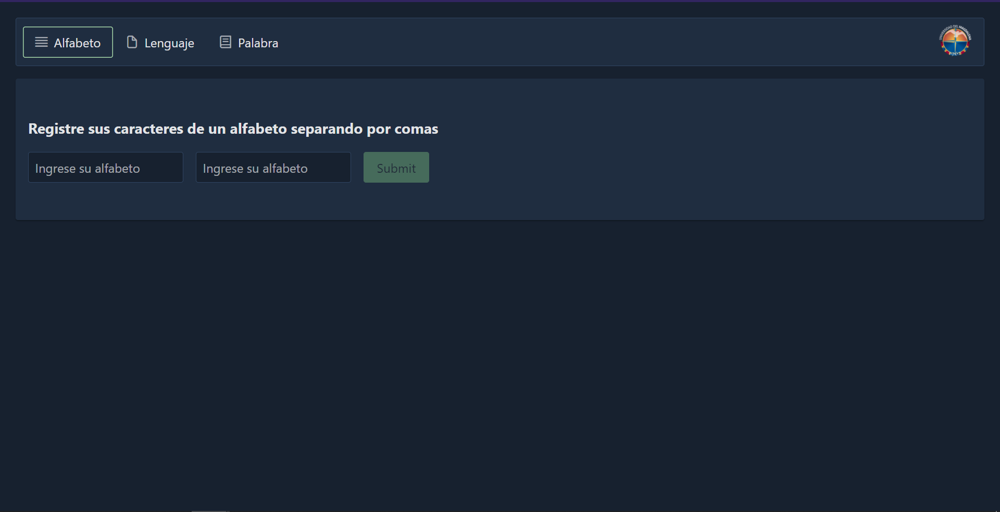
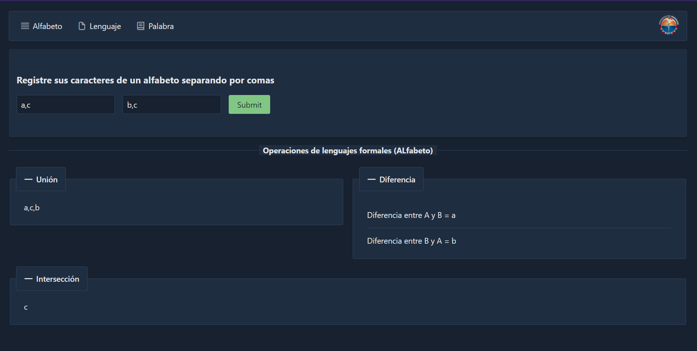
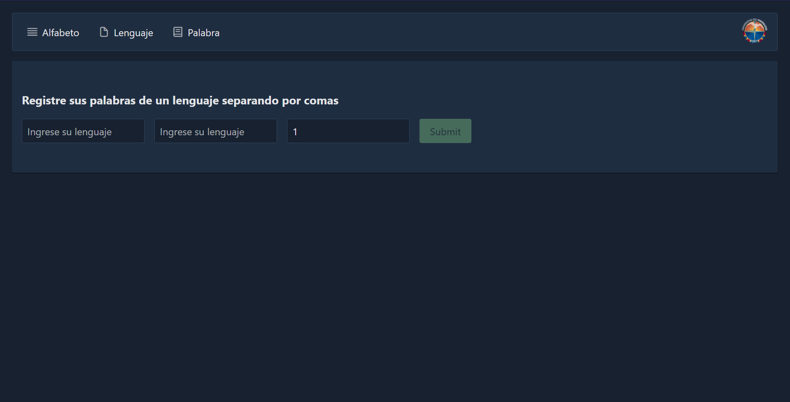
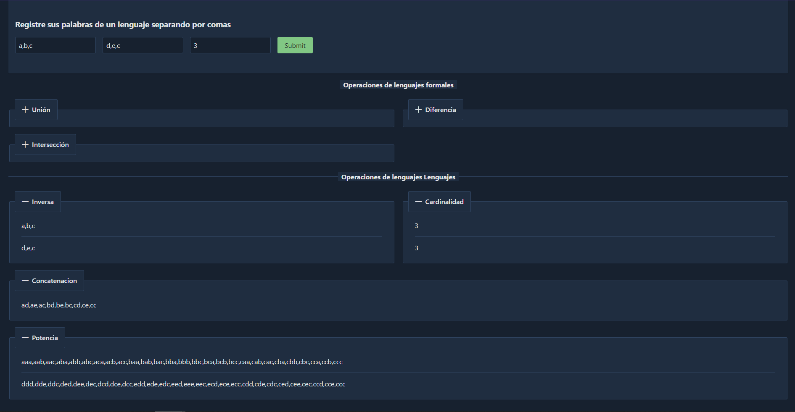
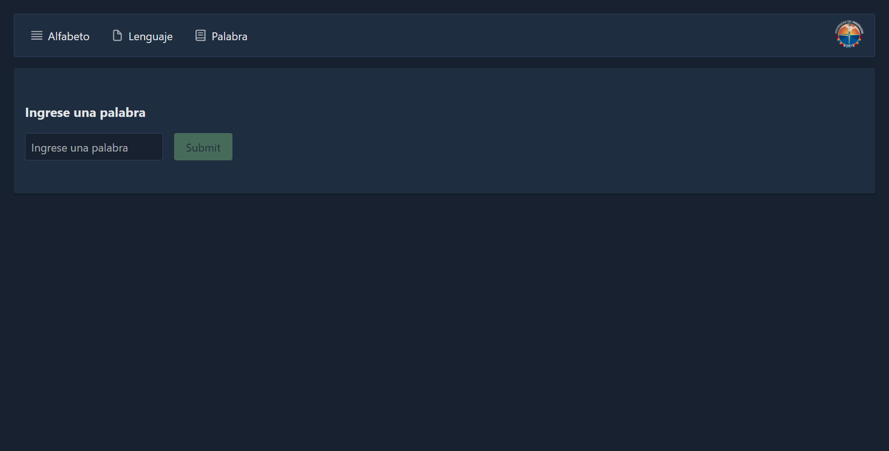
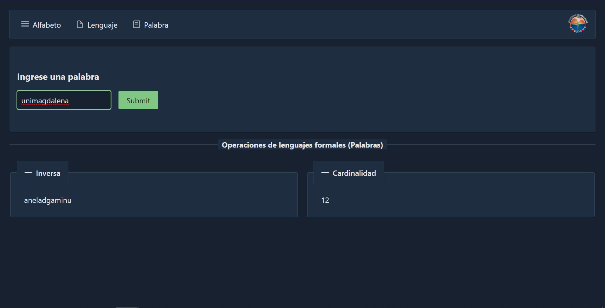

# FormalLanguage

En matemáticas, lógica y ciencias de la computación, un lenguaje formal es un lenguaje cuyos símbolos son primitivos y reglas para unir esos símbolos están formalmente especificados. Al conjunto de los símbolos primitivos se lo llama el alfabeto (o vocabulario) del lenguaje, y al conjunto de las reglas se lo llama la gramática formal (o sintaxis). A una cadena de símbolos formada de acuerdo a la gramática se la llama una fórmula bien formada (o palabra) del lenguaje. Estrictamente hablando, un lenguaje formal es idéntico al conjunto de todas sus fórmulas bien formadas.
FormalLanguage esta desarrollado con typescript lenguaje que se transpila a javascript, Angular, y la parte grafica con primeNg.

Shopping Cart es un demo de un proceso de compra de articulos, llenado de un carro y realizanción  de ordenes, desarrollado con angular 11, manejador de estados ngrx y PrimeNg 
y todo conectado con la base de datos de firebase. 

This project was generated with [Angular CLI](https://github.com/angular/angular-cli) version 11.2.3.

## Link Deploy
Mediante Github Pages = https://johnrubio27.github.io/FormalLanguage/#/alfabeto

## Pasos para deplegar el proyecto de forma local

Descargar el proyecto o utilizar git clone https://github.com/johnrubio27/FormalLanguage

En la terminal en la carpeta del proyecto ejecutar los siguientes comando.

```bash
npm install
ng serve -o
```
## Funcionamiento y vistas del Shopping Cart
| Tipo | Sin Acciones | Operaciones |
| --- | --- | --- |
| Alfabeto |  |  |
| Lengueaje |  |  |
| Palabra |  |  |

El alfabeto cuenta con las siguiente operaciones:
* Unión
* Diferencia
* Intersección

Los lenguaje comparten o heredan las misma operaciones de un alfabeto añadiendo las siguietes:
* Inversa
* Cardinalidad
* Concatenación
* Potencia

Y las palabras tienen en común las operaciones Inversa y Cardinalidad; por lo que también la implementa de la interface FuncionesCompartidas tanto los lenguajes como las palabras. 

This project was generated with [Angular CLI](https://github.com/angular/angular-cli) version 11.2.3.

Proyecto Presentado por:

Leonardo Liñan
John Rubio
